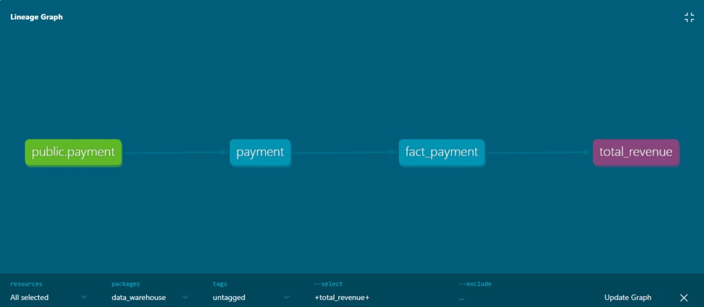
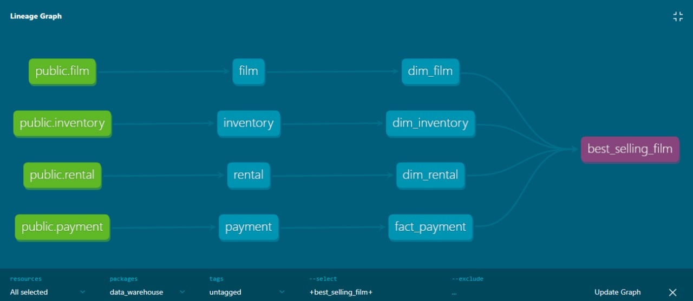
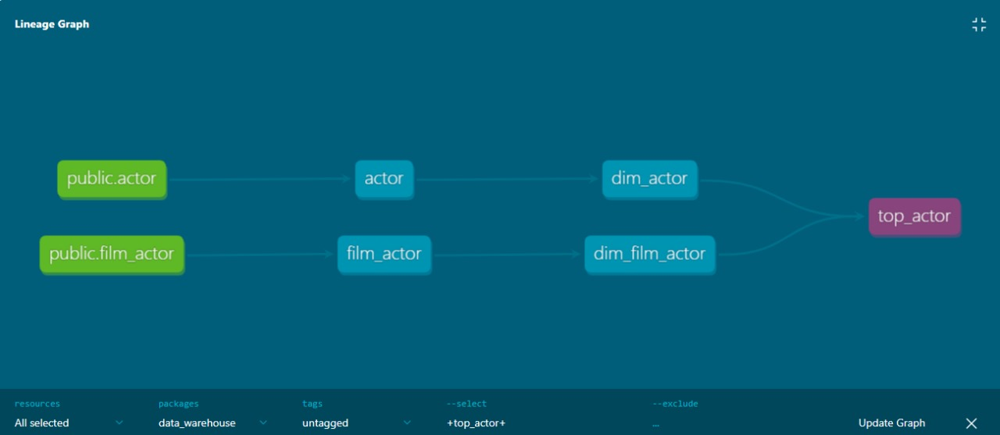

# **Project 2 Using DBT**

Create mart model and write it to mart_dev schema using DBT
- How many monthly total revenue ?
- What is the best selling film ?
- Who is the actor who plays the most roles in films ?

## **Total Revenue**

## **Total Revenue**

## **Top Actors**

